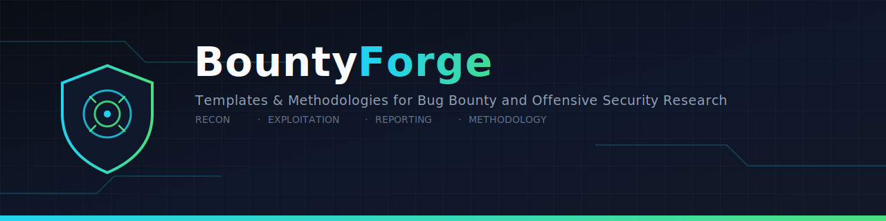

<div align="center">



# BountyForge

**Professional templates, methodologies, checklists, reporting guides, payload references, and reusable resources for Bug Bounty, VDPs, penetration testing, API security, and offensive security research.**

[](LICENSE)
[](.github/workflows/markdown-lint.yml)
[](.github/workflows/link-checker.yml)
[](.github/workflows/spell-check.yml)
[](CONTRIBUTING.md)
[](CHANGELOG.md)

[Getting Started](docs/getting-started.md) · [Report Templates](#report-templates) · [Checklists](#checklists) · [Methodologies](#methodologies) · [Payloads](#payload-references) · [Contributing](#contributing)

</div>

---

## Table of Contents

- [About](#about)
- [Features](#features)
- [Repository Tree](#repository-tree)
- [Report Templates](#report-templates)
- [Checklists](#checklists)
- [Methodologies](#methodologies)
- [Payload References](#payload-references)
- [Tooling Integration](#tooling-integration)
- [Documentation](#documentation)
- [Example Reports](#example-reports)
- [Installation](#installation)
- [Quick Start](#quick-start)
- [Who This Is For](#who-this-is-for)
- [Design Philosophy](#design-philosophy)
- [Roadmap](#roadmap)
- [Contributing](#contributing-1)
- [Security Policy](#security-policy)
- [Code of Conduct](#code-of-conduct)
- [License](#license)
- [Credits](#credits)
- [Support](#support)
- [Disclaimer](#disclaimer)

## About

BountyForge is a reference library built for people who do this work regularly: bug bounty hunters submitting to HackerOne, Bugcrowd, and Intigriti programs; penetration testers who need client-ready report structures; and application security engineers building internal testing playbooks.

It exists because the actual bottleneck in security research is rarely finding a bug — it's doing so systematically enough to find the *right* bugs, and then writing them up in a way that gets triaged quickly and taken seriously. BountyForge addresses both halves of that problem: structured methodology and checklists on the finding side, and complete, CVSS-justified report templates on the writing side.

Every template, checklist, and payload collection in this repository is designed to be copied, filled in, and used immediately — not read once as inspiration. Report templates are pre-structured with every section a mature program expects. Checklists are literal task lists meant to be worked through and checked off during an engagement. Payload references explain *why* a technique works, not just what string to paste, so they remain useful when the exact listed payload gets filtered.

## Features

- **22 report templates** covering the vulnerability classes bug bounty hunters encounter most, each 200–300 lines with CVSS justification, CWE/OWASP mapping, and complete example HTTP request/response pairs.
- **Category-spanning checklists** covering recon, authentication, authorization, API security, and infrastructure categories (cloud, containers, CI/CD), each separating manual from automated tests and including Burp Suite-specific guidance.
- **End-to-end methodology guides** explaining not just *what* to test but *in what order and why*, from initial recon through final reporting.
- **Annotated payload collections** organized by injection context, with detection guidance and filter-bypass reasoning — not bare payload lists.
- **Fully worked example reports** using fictional companies, demonstrating exactly the level of detail expected when using the templates for real.
- **nuclei template pack** aligned with the checklist content, for automating first-pass detection of the misconfigurations this repository teaches you to find manually.
- **Burp Suite configuration guide** covering recommended extensions, Match/Replace rules, and session handling setups referenced throughout the checklists.
- **CI-enforced quality bar**: every merged change passes Markdown linting, link checking, and spell checking automatically.

## Repository Tree

```
BountyForge/
│
├── README.md
├── LICENSE
├── CONTRIBUTING.md
├── SECURITY.md
├── CODE_OF_CONDUCT.md
├── CHANGELOG.md
│
├── assets/
│   ├── banner.svg
│   ├── logo.svg
│   ├── screenshots/
│   └── previews/
│
├── docs/
│   ├── getting-started.md
│   ├── methodology.md
│   ├── reporting-guide.md
│   └── faq.md
│
├── report-templates/
│   ├── xss.md
│   ├── sql-injection.md
│   ├── idor.md
│   ├── ssrf.md
│   └── ... (18 more — see Report Templates below)
│
├── checklists/
│   ├── recon.md
│   ├── authentication.md
│   ├── api-security.md
│   └── ... (more added continuously — see Checklists below)
│
├── methodology/
│   ├── recon.md
│   ├── api-testing.md
│   └── ... (more added continuously — see Methodologies below)
│
├── payloads/
│   ├── xss.md
│   ├── ssrf.md
│   └── ... (more added continuously — see Payload References below)
│
├── references/
│   └── README.md
│
├── examples/
│   └── northwind-docs-stored-xss.md
│
├── nuclei/
│   ├── README.md
│   └── *.yaml
│
├── burp/
│   └── README.md
│
└── .github/
    ├── ISSUE_TEMPLATE/
    ├── workflows/
    └── PULL_REQUEST_TEMPLATE.md
```

## Report Templates

Each template under `report-templates/` includes: Executive Summary, Severity, CVSS (with per-metric justification), CWE, OWASP mapping, Affected Component, Description, Preconditions, Attack Scenario, Reproduction Steps, example HTTP Request/Response, Evidence checklist, Impact, Risk Assessment, Remediation (short- and long-term), References, and Report Notes.

| Template | Status | File |
|---|---|---|
| Cross-Site Scripting (XSS) | ✅ Available | [`report-templates/xss.md`](report-templates/xss.md) |
| SQL Injection | ✅ Available | [`report-templates/sql-injection.md`](report-templates/sql-injection.md) |
| IDOR | ✅ Available | [`report-templates/idor.md`](report-templates/idor.md) |
| SSRF | ✅ Available | [`report-templates/ssrf.md`](report-templates/ssrf.md) |
| CSRF | 🚧 Planned | — |
| SSTI | 🚧 Planned | — |
| XXE | 🚧 Planned | — |
| LFI | 🚧 Planned | — |
| RCE | 🚧 Planned | — |
| Open Redirect | 🚧 Planned | — |
| Host Header Injection | 🚧 Planned | — |
| Race Condition | 🚧 Planned | — |
| Cache Poisoning | 🚧 Planned | — |
| GraphQL | 🚧 Planned | — |
| OAuth | 🚧 Planned | — |
| JWT | 🚧 Planned | — |
| Business Logic | 🚧 Planned | — |
| File Upload | 🚧 Planned | — |
| Authentication | 🚧 Planned | — |
| Authorization | 🚧 Planned | — |
| API Security (general) | 🚧 Planned | — |

> See [Roadmap](#roadmap) and [`CHANGELOG.md`](CHANGELOG.md) for delivery order. Contributions against any "Planned" row are especially welcome — see [Contributing](#contributing-1).

## Checklists

| Checklist | Status | File |
|---|---|---|
| Recon | ✅ Available | [`checklists/recon.md`](checklists/recon.md) |
| Authentication | ✅ Available | [`checklists/authentication.md`](checklists/authentication.md) |
| API Security | ✅ Available | [`checklists/api-security.md`](checklists/api-security.md) |
| Authorization | 🚧 Planned | — |
| JWT | 🚧 Planned | — |
| OAuth | 🚧 Planned | — |
| REST | 🚧 Planned | — |
| SOAP | 🚧 Planned | — |
| GraphQL | 🚧 Planned | — |
| AWS / Azure / GCP / Cloud | 🚧 Planned | — |
| Docker / Kubernetes | 🚧 Planned | — |
| Web | 🚧 Planned | — |
| Mobile | 🚧 Planned | — |
| CI/CD | 🚧 Planned | — |
| SAML | 🚧 Planned | — |
| CORS | 🚧 Planned | — |
| CSP | 🚧 Planned | — |
| Rate Limiting | 🚧 Planned | — |
| Session Management | 🚧 Planned | — |
| Password Reset | 🚧 Planned | — |
| Business Logic | 🚧 Planned | — |

Every checklist separates **manual tests** from **automated tests**, lists **common misconfigurations** with root-cause explanations, includes **Burp Suite-specific tips**, and documents **edge cases and common bypasses** with references.

## Methodologies

| Methodology | Status | File |
|---|---|---|
| Reconnaissance | ✅ Available | [`methodology/recon.md`](methodology/recon.md) |
| API Testing | ✅ Available | [`methodology/api-testing.md`](methodology/api-testing.md) |
| Subdomain Enumeration | 🚧 Planned | — |
| Web Testing | 🚧 Planned | — |
| Authentication Testing | 🚧 Planned | — |
| Authorization Testing | 🚧 Planned | — |
| GraphQL Testing | 🚧 Planned | — |
| Cloud Testing | 🚧 Planned | — |
| JavaScript Analysis | 🚧 Planned | — |
| Source Code Review | 🚧 Planned | — |

Each methodology guide covers objectives, tools, a manual workflow, an automation script, reporting guidance, best practices, common mistakes, and a fully worked example.

## Payload References

| Payload Collection | Status | File |
|---|---|---|
| XSS | ✅ Available | [`payloads/xss.md`](payloads/xss.md) |
| SSRF | ✅ Available | [`payloads/ssrf.md`](payloads/ssrf.md) |
| SSTI | 🚧 Planned | — |
| XXE | 🚧 Planned | — |
| Open Redirect | 🚧 Planned | — |
| Host Header Injection | 🚧 Planned | — |
| SQLi | 🚧 Planned | — |
| CRLF | 🚧 Planned | — |
| CORS | 🚧 Planned | — |
| GraphQL | 🚧 Planned | — |
| JWT | 🚧 Planned | — |

Every payload entry documents **purpose**, **usage**, **detection**, **expected behavior**, and **known bypasses with the underlying reason they work** — never a bare list of strings.

## Tooling Integration

- **[`nuclei/`](nuclei/)** — custom templates aligned with the checklists (exposed API docs, exposed `.git` directories, GraphQL introspection, host header reflection, blind SSRF via OOB interaction), meant to run alongside the official `nuclei-templates` catalog.
- **[`burp/`](burp/)** — recommended extensions, Match/Replace rules, and session handling configuration referenced throughout the checklists.

## Documentation

- [`docs/getting-started.md`](docs/getting-started.md) — repository setup and a walkthrough of the intended workflow.
- [`docs/methodology.md`](docs/methodology.md) — the six-phase testing loop underlying every methodology guide.
- [`docs/reporting-guide.md`](docs/reporting-guide.md) — how to write reports that get triaged quickly, including CVSS scoring pitfalls and evidence standards.
- [`docs/faq.md`](docs/faq.md) — scope, ethics, tooling, and contribution questions answered directly.

## Example Reports

Fully worked, illustrative reports using fictional companies — never copied from real disclosed reports — demonstrating the expected level of detail:

- [`examples/northwind-docs-stored-xss.md`](examples/northwind-docs-stored-xss.md) — Stored XSS via unsanitized Markdown raw-HTML passthrough in a collaborative document comment feature.

## Installation

BountyForge is documentation and reference material — there is nothing to compile or install to *use* it. Clone it locally so you have offline access and can track updates:

```bash
git clone https://github.com/bountyforge/BountyForge.git
cd BountyForge
```

If you plan to run the nuclei template pack, install nuclei separately:

```bash
go install -v github.com/projectdiscovery/nuclei/v3/cmd/nuclei@latest
nuclei -update-templates
```

If you plan to contribute, install the local linting toolchain:

```bash
npm install --no-save markdownlint-cli2 cspell
```

## Quick Start

```bash
# 1. Clone
git clone https://github.com/bountyforge/BountyForge.git && cd BountyForge

# 2. Read the getting-started guide
$EDITOR docs/getting-started.md

# 3. Copy a report template for the finding you're about to write up
cp report-templates/xss.md ~/engagements/acme-corp/reports/stored-xss-profile-bio.md

# 4. Work a checklist during testing
cp checklists/api-security.md ~/engagements/acme-corp/notes/api-checklist.md

# 5. Run the aligned nuclei templates as a first pass (only against authorized scope)
nuclei -u https://acme-corp-target.example -t nuclei/ -severity medium,high,critical
```

## Who This Is For

- **Bug bounty hunters** who want consistent, complete report structures that speed up triage and reduce back-and-forth.
- **Penetration testers** who need client-ready templates that map cleanly to CVSS, CWE, and OWASP without building that mapping from scratch on every engagement.
- **AppSec engineers** building internal testing playbooks for their own product security reviews.
- **Security researchers learning a new vulnerability class**, using the methodology and payload references as a structured on-ramp rather than scattered blog posts.

It assumes working knowledge of HTTP and general web application concepts. Complete beginners should pair it with a structured learning resource — see [`references/README.md`](references/README.md) for recommendations.

## Design Philosophy

- **Complete over quick.** Every template and checklist is meant to be used as-is on a real engagement, not treated as a rough starting point requiring significant rework.
- **Explain the mechanism, not just the payload.** A payload that works today against one target may not work tomorrow against another; understanding *why* it works is what transfers.
- **Authorized testing only.** Every piece of content assumes and reinforces testing systems you are explicitly authorized to test. See [`CONTRIBUTING.md`](CONTRIBUTING.md) for the full content policy.
- **No copied disclosure content.** Example reports use fictional companies. Real disclosed reports are referenced and linked, never reproduced.
- **Maintained, not archived.** Content is expected to be revisited as CVSS versions, OWASP Top 10 editions, and framework defaults change over time — see [`CHANGELOG.md`](CHANGELOG.md).

## Roadmap

- [ ] Complete the remaining 18 report templates (tracked per-item in the [Report Templates](#report-templates) table)
- [ ] Complete the remaining 18 checklists (tracked per-item in the [Checklists](#checklists) table)
- [ ] Complete the remaining 8 methodology guides (tracked per-item in the [Methodologies](#methodologies) table)
- [ ] Complete the remaining 9 payload references (tracked per-item in the [Payload References](#payload-references) table)
- [ ] Expand the nuclei template pack alongside each new checklist
- [ ] Add a second and third fully worked example report (GraphQL-driven and cloud-misconfiguration-driven scenarios)
- [ ] Add a `docs/pgp-key.asc` for encrypted security reports per `SECURITY.md`
- [ ] Evaluate a static site (GitHub Pages) rendering of the full reference set for easier browsing outside of GitHub's file browser

Track progress in detail via [`CHANGELOG.md`](CHANGELOG.md) and the open issues labeled `content`.

## Contributing

Contributions are welcome and are the primary way this repository grows. Please read [`CONTRIBUTING.md`](CONTRIBUTING.md) in full before opening a pull request — it covers content standards, style guide, and the specific structural requirements for report templates, checklists, and payload collections. Also read [`CODE_OF_CONDUCT.md`](CODE_OF_CONDUCT.md).

Good first contributions:
- Fill in any "🚧 Planned" row in the tables above.
- Fix a broken link or outdated CVSS/CWE reference (flagged via the Bug Report issue template).
- Add a new nuclei template aligned with an existing checklist.

## Security Policy

See [`SECURITY.md`](SECURITY.md) for how to report a security issue with the repository itself (e.g., a compromised CI workflow), and for an explicit reminder that all content here is intended for authorized testing only.

## Code of Conduct

This project follows the [Contributor Covenant](CODE_OF_CONDUCT.md). By participating, you agree to uphold it.

## License

Released under the [MIT License](LICENSE). You are free to use, modify, and redistribute this content, including commercially, with attribution appreciated but not required beyond the license terms.

## Credits

Maintained by the BountyForge community. Contributors are listed here after their first merged pull request.

<!-- CONTRIBUTORS:START -->
*This section is updated as contributions are merged. Be the first — see [Contributing](#contributing-1).*
<!-- CONTRIBUTORS:END -->

Built with reference to, and in the spirit of, other respected open-source security projects — particularly [PayloadsAllTheThings](https://github.com/swisskyrepo/PayloadsAllTheThings), [SecLists](https://github.com/danielmiessler/SecLists), and the [OWASP Cheat Sheet Series](https://cheatsheetseries.owasp.org/) — without reproducing their content directly.

## Support

- **Questions**: open a [GitHub Discussion](https://github.com/bountyforge/BountyForge/discussions) or a `question`-labeled issue.
- **Bugs in this repository's content**: use the Bug Report issue template.
- **Feature requests**: use the Feature Request issue template.
- **Security issues with the repository itself**: follow [`SECURITY.md`](SECURITY.md).

## Disclaimer

BountyForge is provided for educational and authorized security testing purposes only. Every template, checklist, methodology, and payload in this repository assumes you have explicit authorization to test the systems you apply it to — through a bug bounty program's published scope, a signed penetration testing engagement, or infrastructure you own. Unauthorized testing of systems you do not have permission to test is illegal in most jurisdictions. The maintainers and contributors of BountyForge are not responsible for misuse of the content in this repository.

<div align="center">

**[⬆ Back to top](#bountyforge)**

</div>
